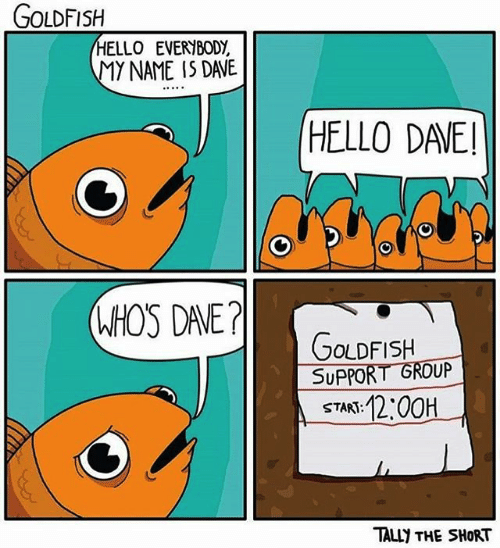

```{r setup, include=FALSE}
knitr::opts_chunk$set(echo = FALSE, message = FALSE)
knitr::opts_knit$set(root.dir = here::here())
options(htmltools.dir.version = FALSE)
library(tidyverse)
theme_set(theme_minimal())
library(xaringanExtra)
use_xaringan_extra(c("panelset", "tachyons"))
```

# The big questions

<br>
<br>

## Is there (not) an effect of X on Y?

## What is the effect of X on Y?

## Given two or more hypotheses, which is the most compatible with the data?

---

class: center middle inverse

# Practical reasons


---

# BRMs always converge, while LMERs don't always do

.center[

]

---

# Frequentist LMER can lead to anti-conservative *p*-values

.bg-washed-yellow.b--gold.ba.bw2.br3.shadow-5.ph4.mt5[
**Heisig and Schaeffer 2019**

- Not including random slopes increases the false-positive rate (Type I error rate).
]

.bg-washed-yellow.b--gold.ba.bw2.br3.shadow-5.ph4.mt5[

**Lindley's paradox**

- Frequentist model rejects $H_0$ while Bayesian model favours it.
]

---

# LMERs require as much work as BRMs

.center[

]

---

# LMERs require as much work as BRMs

.center[

]

---

# You can embed prior knowledge in BRMs while you can't in LMERs

.center[

]

.f6[
(Actually, it's a myth: https://thinking.umwblogs.org/2020/02/26/goldfish-memory/)
]

---

# You can embed prior knowledge in BRMs while you can't in LMERs

.center[

]

---

# Bayesian inference is more intuitive than frequentist inference

.bg-washed-blue.b--dark-blue.ba.bw2.br3.shadow-5.ph4.mt5[

The ***p*-value** is the probability of finding a certain difference or a bigger difference, assuming that there is no difference. 😱😱😱

]

--

.center[
<div style="width:400px;height:400px;position:relative;"><iframe src="https://giphy.com/embed/xkQztEUp95DS8" width="100%" height="100%" style="position:absolute" frameBorder="0" class="giphy-embed" allowFullScreen></iframe></div>
]

---

# Bayesian inference is more intuitive than frequentist inference

.bg-washed-green.b--dark-green.ba.bw2.br3.shadow-5.ph4.mt5[

A **Bayesian posterior probability distribution** tells you the probability that the estimated effect falls within a specific range of values.

]

---

class: center middle inverse

# Conceptual reasons

---

# LMERs only provide evidence for rejecting the Null Hypothesis

---

# A frequentist CI is not what most people think it is

---

# With BRMs you can compare any hypothesis, not just null/alternative

---

# LMER is based on an imaginary set of experiments

---

# BRMs will converge towards the true value in the long run
